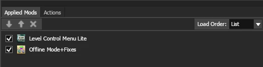

# Hosting via client

### Garden warfare 1

1. Download the archive from [releases](https://github.com/nocss42/GardenGate/releases)

2. Open up the launcher go to patcher and press auto detect > patch (keep the ip section empty)

3. Download map loader dll of your choice;

We recommend;

[CinematicTools](https://www.nexusmods.com/plantsvszombiesgardenwarfare/mods/25?tab=files)

[PvzShooterHax](https://github.com/natv1337/PVZShooterHax/releases)

Put the one of your choice to game's directory and name it as `level_loader.dll` and the launcher will auto inject it upon pressing launch.

4. Press load map from in-game ui of your dll and your server should be up

### Garden warfare 2

1. Download the archive from [releases](https://github.com/nocss42/GardenGate/releases) 

2. Download the FBPACK from the repository [here](../Mods/gw2/GardenGate.fbpack)

3. Import the FBPack in Frosty Mod Manager, the load order should be something like this;

4. Open up the launcher go to patcher and press auto detect > patch (keep the ip section empty)

5. Host any map of your choice through the multiplayer portal / offline level loader

### Battle for Neighborville

1. Download the archive from [releases](https://github.com/nocss42/GardenGate/releases)

2. Open up the launcher go to patcher and press auto detect > patch (keep the ip section empty)

3. Host any map of your choice through the multiplayer portal

### (Make sure to port forward `25200` or use some sort of VPN software)
### Use [ZeroTier](https://www.zerotier.com/download) , [RadminVPN](https://vpn.net) or [playit.gg](https://playit.gg) Add your friends to the network and join by the IP it provides.

